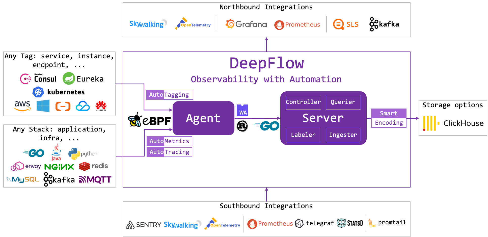

  

  
Instant Observability for Cloud-Native Applications

  
Zero Code, Full Stack, eBPF & Wasm

    
     </a>
     </a>
     </a>

-------------

简体中文 | [English](./README.md)

# 什么是 DeepFlow

DeepFlow 开源项目旨在为复杂的云基础设施及云原生应用提供深度可观测性。DeepFlow 基于 eBPF 实现了**零侵扰**（**Zero Code**）的指标、分布式追踪、调用日志、函数剖析数据采集，并结合智能标签（**SmartEncoding**）技术实现了所有观测数据的**全栈**（**Full Stack**）关联和高效存取。使用 DeepFlow，可以让云原生应用自动具有深度可观测性，从而消除开发者不断插桩的沉重负担，并为 DevOps/SRE 团队提供从代码到基础设施的监控及诊断能力。

# 核心特性

- **任意** Service 的**全景图**：利用 eBPF **零侵扰**绘制生产环境的全景图，包括任意语言开发的服务、未知代码的第三方服务、所有的云原生基础设施服务。内置标准协议解析能力，并提供 Wasm 插件机制扩展解析任意私有协议。零侵扰计算每一次调用在应用程序和基础设施中的**全栈**黄金指标，快速定界性能瓶颈。
- **任意** Request 的**分布式追踪**：基于 eBPF 的**零侵扰**分布式追踪能力，支持任意语言的应用程序，并完整覆盖网关、服务网格、数据库、消息队列、DNS、网卡等各类基础设施，不留下任何追踪盲点。**全栈**，自动采集每个 Span 关联的网络性能指标和文件读写事件。从此，分布式追踪进入零插桩的新时代。
- **任意** Function 的**持续性能剖析**：以低于 1% 的开销**零侵扰**采集生产环境进程的性能剖析数据，绘制函数粒度的 OnCPU、OffCPU 火焰图，快速定位应用函数、库函数、内核函数的**全栈**性能瓶颈，并自动关联至分布式追踪数据。即使在 2.6+ 内核版本下，仍然可提供网络性能剖析能力，洞察代码性能瓶颈。
- **无缝集成**流行的可观测性技术栈：可作为 Prometheus、OpenTelemetry、SkyWalking、Pyroscope 的存储后端，亦可提供 **SQL、PromQL、OTLP** 等数据接口作为流行技术栈的数据源。自动为所有观测信号注入统一标签，包括云资源、K8s 容器资源、K8s Label/Annotation、CMDB 中的业务属性等，消除数据孤岛。
- 存储性能 **10x ClickHouse**：基于 **SmartEncoding** 机制，向所有观测信号注入标准化的、预编码的元标签，相比 ClickHouse 的 String 或 LowCard 方案均可将存储开销降低 10x。自定义标签与观测数据分离存储，从此你可安心注入近乎无限维度和基数的标签，且可获得像 **BigTable** 一样的轻松查询体验。

# 文档

详细信息请访问[文档站点](https://deepflow.io/docs/zh/?from=github)。

# 快速上手

DeepFlow 共有三种版本：
- DeepFlow Community：DeepFlow 社区版，面向开发人员
- DeepFlow Enterprise：DeepFlow 企业版，面向组织、解决团队协作的问题
- DeepFlow Cloud：DeepFlow SaaS 服务，目前处于测试阶段

DeepFlow 社区版由企业版的核心组件构成。通过开源，我们希望让观测更自动，让全世界的开发者更自由。

## 部署 DeepFlow Community

请参考[文档](https://deepflow.io/docs/zh/ce-install/all-in-one/?from=github)部署 DeepFlow Community。

同时我们也搭建了一个完整的 [DeepFlow Community Demo](https://ce-demo.deepflow.yunshan.net/?from=github)，欢迎体验。登录账号 / 密码：deepflow / deepflow。

## 体验 DeepFlow Enterprise

你可以访问 [DeepFlow Enterprise Demo](https://deepflow.io/)，目前仅支持中文。

# 从源码编译 DeepFlow

- [编译 deepflow-agent](./agent/build_cn.md)

# 软件架构

DeepFlow Community 版本主要由 Agent 和 Server 两个进程组成。每个 K8s 容器节点、传统服务器或云服务器中运行一个 Agent ，负责该服务器上所有应用进程的数据采集。Server 运行在一个 K8s 集群中，提供 Agent 管理、标签注入、数据写入、数据查询服务。

# 里程碑

这里有我们[未来的 Feature 规划](https://deepflow.io/docs/zh/about/milestone/?from=github)。欢迎 Issue 和 Pull Request。

# 联系我们

- Discord：点击 [此链接](https://discord.gg/QJ7Dyj4wWM) 加入 Discord 频道.
- Twitter：[DeepFlow](https://twitter.com/deepflowio)
- 微信群：

# 致谢

- 感谢 [eBPF](https://ebpf.io/)，革命性的 Linux 内核技术
- 感谢 [OpenTelemetry](https://opentelemetry.io/)，提供了采集应用可观测性数据的标准 API

# 荣誉

- DeepFlow 的论文 [Network-Centric Distributed Tracing with DeepFlow: Troubleshooting Your Microservices in Zero Code](https://dl.acm.org/doi/10.1145/3603269.3604823) 已被国际顶会 ACM SIGCOMM 2023 录用
- DeepFlow 已加入 <a href="https://landscape.cncf.io/?selected=deep-flow">CNCF CLOUD NATIVE Landscape</a>
- DeepFlow 已加入 <a href="https://ebpf.io/applications#deepflow">eBPF Project Landscape</a>
