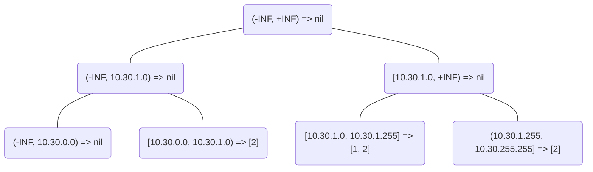

简介
====

此工程包含的是droplet所需的公有数据结构和公共函数

queue队列
---------

虽然Golang已经在`github.com/golang-collections/go-datastructures的PriorityQueue`
提供了`Queue`和`PriorityQueue`，但是在这些方面它们不能够满足我们的需求：

1. 我们需要的是一个固定长度的queue，虽然这可以通过外部代码判断当前queue长度解决
2. 当超出queue尺寸时，我们希望直接覆盖掉queue中较旧的数据
3. 它们入队和出队的机制恐怕会导致较为频繁的内存申请，而我们更期望使用环形数组来减少内存申请
4. 我们希望Queue能够通过statsd上报当前的队列长度，以方便分析组件间的性能瓶颈

从性能数据上看，queue单次入队需要耗费73.7 ns/op，单次出队需要耗费24.8 ns/op，而如果8个协程同时出队，
开销则会上升到235 ns/op。因此在接收处应当尽可能通过Gets来单次获取尽可能多的数据，
此时如果性能瓶颈在于接收端，单个消息的时间开销将会接近1 ns/op，想来已经足够的高效了。

segmenttree线段树
-----------------

这里的线段树实现的是一个不可变的多维线段树，用于合并交叠数据并提供查询。一个典型示例如下：

假设存在如下的数据需要生成线段树
```
10.30.1.0/24 => 1
10.30.0.0/16 => 2
```

那么生成的树将会是


那么我想要查询10.30.1.128/23所对应的数据集时，便能够得到[1, 2]的结果
