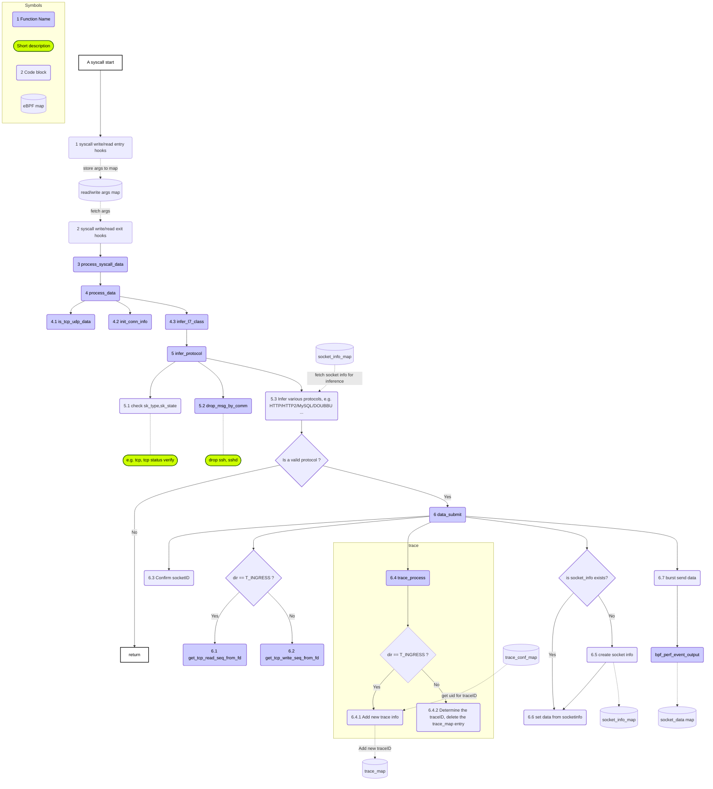
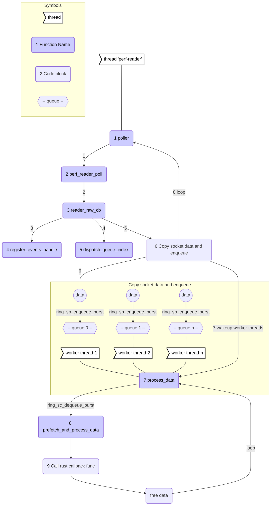
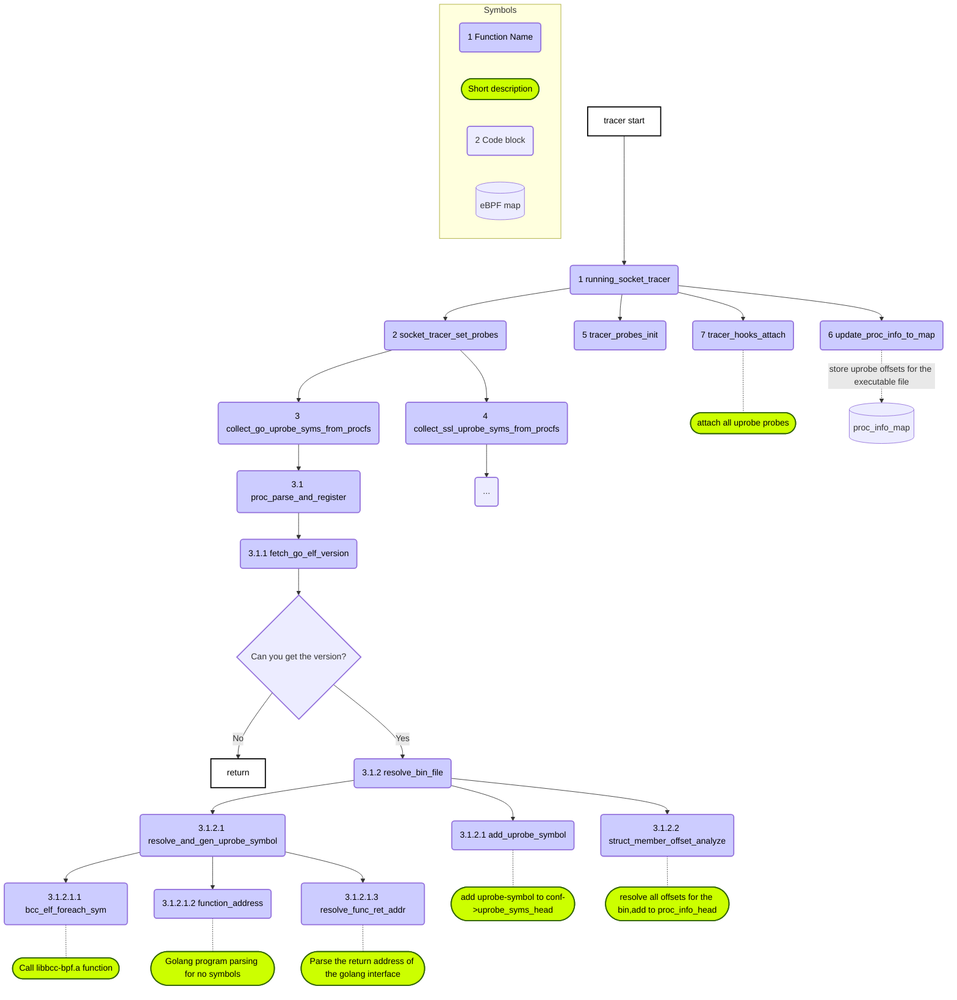
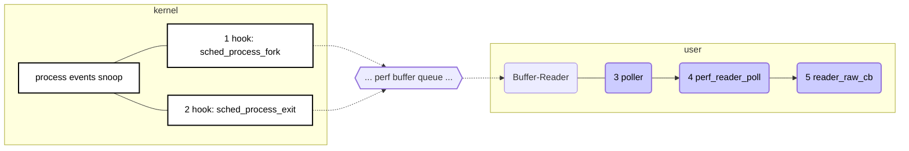
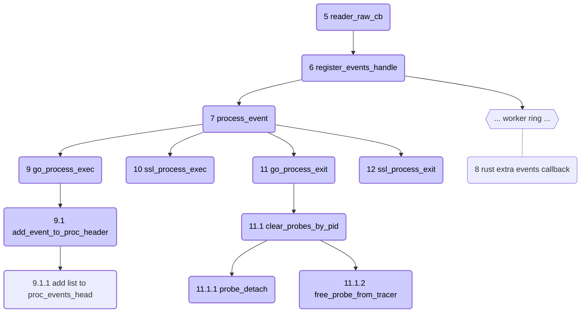
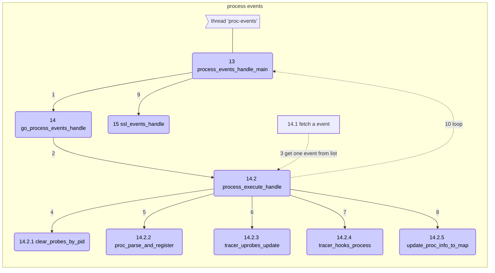

# libtrace

This is a library that uses eBPF technology to obtain the tracking data. It can use very simple interface calls to get any valuable data from the kernel or application.

Provides the Rust language interface.

Currently support `x86_64` and `arm64` architectures.

[Kernel version and feature support](https://github.com/deepflowio/docs/blob/main/docs/zh/02-ce-install/01-overview.md#%E8%BF%90%E8%A1%8C%E6%9D%83%E9%99%90%E5%8F%8A%E5%86%85%E6%A0%B8%E8%A6%81%E6%B1%82)

# Protocol Tracing

Deepflow-agent deploys eBPF probes (kprobe/traceponit) on Linux syscalls. When application makes network-related syscalls, deepflow-agent's eBPF probes snoop the data.

The following protocols are currently probed:

- HTTP1
- HTTP2
- DUBBO
- GRPC
- SOFARPC
- MYSQL
- POSTGRESQL
- REDIS
- KAFKA
- MQTT
- DNS
- TLS(handshake)
- MONGO
- ORACLE
- FASTCGI

## TLS/SSL Tracing

Currently only for Golang programs and openssl.

Use eBPF user-space probes (uprobes), set up on the Golang application's TLS API.

HTTP1 and HTTP2 protocals data are currently probed on TLS/SSL.

Trace to the Golang program is implemented by the following method:
- All the currently running Golang binary executables are found by traversing Procfs, and then the files are parsed to obtain the Golang version, trace symbol offset address, structure member offsets and other informations.
- Create probes and attach based on the parsed datas.
- Capture process execute/exit events by tracking two tracepoints(`tracepoint/sched/sched_process_fork` and `tracepoint/sched/sched_process_exit`). Update probes based on captured events.

Note: In order to avoid attaching/detaching the golang program repeatedly, it is necessary to confirm that the golang application has been running stably before DeepFlow-agent starts the attach operation. After DeepFlow-agent detects that the golang application is loaded, it delays the attach operation for 60 seconds. Openssl only supports kernel 4.17 and above.

# Implement logic

Note: The numbers in the figure below indicate the calling sequence.

## Userspace tracer startup

```mermaid
graph LR
subgraph Symbols
    style illustration-func fill:#ccff,color:#000, stroke-width:2px
    style illustration-info fill:#cf0,color:#000,stroke:#360,stroke-width:2px
    style illustration-code-block stroke-width:2px
    illustration-func(1 Function Name)
    illustration-info([Short description])
    illustration-code-block(2 Code block)
    illustration_map[(eBPF map)]
end
    style enable_ebpf_protocol-i fill:#cf0,color:#000,stroke:#360,stroke-width:2px
    style running_socket_tracer-10-i fill:#cf0,color:#000,stroke:#360,stroke-width:2px
    style running_socket_tracer-11-i fill:#cf0,color:#000,stroke:#360,stroke-width:2px
    style running_socket_tracer-13-i fill:#cf0,color:#000,stroke:#360,stroke-width:2px
    style running_socket_tracer-14-i fill:#cf0,color:#000,stroke:#360,stroke-width:2px
    style running_socket_tracer-15-i fill:#cf0,color:#000,stroke:#360,stroke-width:2px
    style running_socket_tracer-16-i fill:#cf0,color:#000,stroke:#360,stroke-width:2px
    style running_socket_tracer-3-i fill:#cf0,color:#000,stroke:#360,stroke-width:2px
    style running_socket_tracer-4-i fill:#cf0,color:#000,stroke:#360,stroke-width:2px
    style running_socket_tracer-1-i fill:#cf0,color:#000,stroke:#360,stroke-width:2px
    style running_socket_tracer-8-i fill:#cf0,color:#000,stroke:#360,stroke-width:2px
    style running_socket_tracer-9-i fill:#cf0,color:#000,stroke:#360,stroke-width:2px
    style bpf_tracer_finish-i fill:#cf0,color:#000,stroke:#360,stroke-width:2px
    style FEATUER-i fill:#cf0,color:#000,stroke:#360,stroke-width:2px
    style start fill:#fff,color:#000,stroke:#000,stroke-width:2px
    style enable_ebpf_protocol fill:#ccff,color:#000, stroke-width:2px
    style FEATUER fill:#ccff,color:#000, stroke-width:2px
    style bpf_tracer_init fill:#ccff,color:#000, stroke-width:2px
    style running_socket_tracer fill:#ccff,color:#000, stroke-width:2px
    style running_socket_tracer-1 fill:#ccff,color:#000, stroke-width:2px
    style running_socket_tracer-2 fill:#ccff,color:#000, stroke-width:2px
    style running_socket_tracer-3 stroke-width:2px
    style running_socket_tracer-4 fill:#ccff,color:#000, stroke-width:2px
    style running_socket_tracer-5 stroke-width:2px
    style running_socket_tracer-6 fill:#ccff,color:#000, stroke-width:2px
    style running_socket_tracer-7 stroke-width:2px
    style running_socket_tracer-8 fill:#ccff,color:#000, stroke-width:2px
    style running_socket_tracer-9 fill:#ccff,color:#000, stroke-width:2px
    style running_socket_tracer-10 fill:#ccff,color:#000, stroke-width:2px
    style running_socket_tracer-11 fill:#ccff,color:#000, stroke-width:2px
    style running_socket_tracer-12 fill:#ccff,color:#000, stroke-width:2px
    style running_socket_tracer-13 fill:#ccff,color:#000, stroke-width:2px
    style running_socket_tracer-14 fill:#ccff,color:#000, stroke-width:2px
    style running_socket_tracer-16 fill:#ccff,color:#000, stroke-width:2px
    style running_socket_tracer-2-2 fill:#ccff,color:#000, stroke-width:2px
    style running_socket_tracer-2-3 fill:#ccff,color:#000, stroke-width:2px
    style bpf_tracer_finish fill:#ccff,color:#000, stroke-width:2px
    style bpf_tracer_init-1 stroke-width:2px
    style bpf_tracer_init-2 stroke-width:2px
    style bpf_tracer_init-3 stroke-width:2px
    start[tracer start]
    start --> enable_ebpf_protocol(1 enable_ebpf_protocol) -.- enable_ebpf_protocol-i([ebable application layer protocols]) 
    start --> FEATUER(2 set_feature_regex) -.- FEATUER-i([Uprobe OPENSSL/GOLANG filter])
    start --> bpf_tracer_init(3 bpf_tracer_init)

    start --> running_socket_tracer(4 running_socket_tracer)
    start --> bpf_tracer_finish(5 bpf_tracer_finish)-.-bpf_tracer_finish-i([Indicates that all probes have been set])
    
    bpf_tracer_init --> bpf_tracer_init-1(3.1 set bpf_jit_enable,sys_boot_time,max_locked_memory)
    bpf_tracer_init --> bpf_tracer_init-2(3.2 set log)
    bpf_tracer_init --> bpf_tracer_init-3(3.3 new thread - ctrl_main)
    bpf_tracer_init --> bpf_tracer_init-4(3.4 register kick_kern)

    running_socket_tracer --> running_socket_tracer-1(4.1 check_kernel_version)-.- running_socket_tracer-1-i([Support linux 4.14+])
    running_socket_tracer --> running_socket_tracer-2(4.2 socket_tracer_set_probes)
    running_socket_tracer-2 --> running_socket_tracer-2-1(4.2.1 Set kprobe,uprobe for attach/detach)
    running_socket_tracer-2 --> running_socket_tracer-2-2(4.2.2 collect_go_uprobe_syms_from_procfs)
    running_socket_tracer-2 --> running_socket_tracer-2-3(4.2.3 collect_ssl_uprobe_syms_from_procfs)
    running_socket_tracer --> running_socket_tracer-3(4.3 extra events list init) -.- running_socket_tracer-3-i([process exec/exit event snoop])
    running_socket_tracer --> running_socket_tracer-6(4.4 setup_bpf_tracer)

    running_socket_tracer --> running_socket_tracer-4(4.5 maps_config)-.-running_socket_tracer-4-i([set socket/trace map entries count])
    running_socket_tracer --> running_socket_tracer-5(4.6 set perf buffer reader callback) 
    running_socket_tracer --> running_socket_tracer-7(4.7 set socket_map_max_reclaim value) 
    running_socket_tracer --> running_socket_tracer-8(4.8 tracer_bpf_load)-.-running_socket_tracer-8-i([load ebpf progs and create maps])
    running_socket_tracer --> running_socket_tracer-9(4.9 tracer_probes_init)-.-running_socket_tracer-9-i([Call create_probe, prepare all probes before attach/detach])
    running_socket_tracer --> running_socket_tracer-10(4.10 update_offset_map_from_btf_vmlinux)-.-running_socket_tracer-10-i([Get the offsets from the BTF files, these offsets are used by the eBPF programs])
    running_socket_tracer-10 -.-> |store member offset to map |members_offset_map[(members_offset map)] 
    running_socket_tracer --> running_socket_tracer-11(4.11 update_proc_info_to_map) -.- running_socket_tracer-11-i([set go/ssl uprobe offsets])
    running_socket_tracer-11-.->|store uprobe offsets for the executable file|proc_info_map[(proc_info_map)]
    running_socket_tracer --> running_socket_tracer-12(4.12 update_protocol_filter_array)
    running_socket_tracer --> running_socket_tracer-13(4.13 tracer_hooks_attach) -.-running_socket_tracer-13-i([attach all probes])
    running_socket_tracer --> running_socket_tracer-14(4.14 perf_map_config) -.- running_socket_tracer-14-i([set perf buffer reader share memory])
    running_socket_tracer --> running_socket_tracer-15(4.15 set trace uid) -.- running_socket_tracer-15-i([use for socketID,traceID,capSeq])
    running_socket_tracer-15 -.-> |Prepare various UIDs to map|trace_conf_map[(trace_conf_map)]
    running_socket_tracer --> running_socket_tracer-16(4.16 dispatch_worker) -.- running_socket_tracer-16-i([userspace receive and distribute eBPF data to work queue initialization])
    running_socket_tracer --> running_socket_tracer-17(4.17 register_extra_waiting_op server/client for getting kernel struct member offset)
    running_socket_tracer --> running_socket_tracer-18(4.18 register_period_event_op kick kernel for getting kernel struct member offset)
    running_socket_tracer --> running_socket_tracer-19(4.19 new thread for process events)
```

## Kernel eBPF process

## Receive data

## Uprobe userspace boot

**Explanation:**

- 3 collect_go_uprobe_syms_from_procfs
  - Find all golang binary executables from Procfs,parse and register uprobe symbols.
- 3.1.2 resolve_bin_file
  - Resolve our pre-defined all symbols in the specified file.
- 3.1.2.1 resolve_and_gen_uprobe_symbol
  - Finish parsing the given symbol in the binary and generate the uprobe_symbol.

## Probes management

For all probes we provide two APIs(socket_tracer_start()/socket_tracer_stop()) to enable/disable probes, it will attach/detach all probes.

### Uprobes monitor

**Explanation:**

- 7 process_event 
  - According to the event_type is EVENT_TYPE_PROC_EXEC or EVENT_TYPE_PROC_EXIT to determine the final call interface. EVENT_TYPE_PROC_EXEC(call go_process_exec(), ssl_process_exec),EVENT_TYPE_PROC_EXIT(call go_process_exit(), ssl_process_exit()).
- 8 rust extra events callback
  - We provide a function that the user can register a callback interface for a specific event. e.g. Use rust function process these events.
- 9.1 add_event_to_proc_header
  - Add `struct process_event` to list-head(proc_events_head), need to set a expire time in `struct process_event`, see the description of [TLS/SSL Tracing](https://github.com/deepflowio/deepflow/tree/main/agent/src/ebpf#tlsssl-tracing) for the reason.
- 14.2.1 clear_probes_by_pid
  - Clear all probe, when process id == pid (event fetched).
- 14.2.2 proc_parse_and_register
  - Resolve symbols and register uprobe symbols.
- 14.2.3 tracer_uprobes_update
  - Update uprobes list
- 14.2.4 tracer_hooks_process
  - Execute attach probes
- 14.2.5 update_go_offsets_to_map
  - Update proc_info_map

# Tested kernel version

- 4.14.x
  - 4.14.0, 4.14.10, 4.14.11, 4.14.1, 4.14.12, 4.14.13, 4.14.14, 4.14.15, 4.14.2, 4.14.3, 4.14.4, 4.14.5, 4.14.6, 4.14.7, 4.14.8, 4.14.9
- 4.15.x
  - 4.15.0, 4.15.1, 4.15.10, 4.15.11, 4.15.12, 4.15.13, 4.15.14, 4.15.15, 4.15.2, 4.15.3, 4.15.4, 4.15.5, 4.15.6, 4.15.7, 4.15.8, 4.15.9
- 4.16.x
  - 4.16.0, 4.16.1, 4.16.10, 4.16.11, 4.16.12,4.16.13, 4.16.2, 4.16.3, 4.16.4, 4.16.5, 4.16.6, 4.16.7, 4.16.8, 4.16.9
- 4.17.x
  - 4.17.0, 4.17.1, 4.17.10, 4.17.11,4.17.12, 4.17.13, 4.17.14, 4.17.2, 4.17.3, 4.17.4, 4.17.5, 4.17.6, 4.17.8, 4.17.9 
- 4.18.x
  - 4.18.0, 4.18.1, 4.18.10,4.18.11, 4.18.12, 4.18.13, 4.18.14, 4.18.15, 4.18.16, 4.18.3, 4.18.4, 4.18.5, 4.18.6, 4.18.7, 4.18.8, 4.18.9
- 4.19.x
  - 4.19.0, 4.19.1, 4.19.10, 4.19.11, 4.19.12, 4.19.2, 4.19.3, 4.19.4, 4.19.5, 4.19.6, 4.19.7, 4.19.8, 4.19.9 
- 4.20.x
  - 4.20.0,4.20.1, 4.20.10, 4.20.11, 4.20.12, 4.20.13, 4.20.2, 4.20.3, 4.20.4, 4.20.5, 4.20.6, 4.20.7, 4.20.8
- 5.0.x
  - 5.0.0, 5.0.0,5.0.1, 5.0.10, 5.0.11, 5.0.12, 5.0.13, 5.0.2, 5.0.3, 5.0.4, 5.0.5, 5.0.6, 5.0.7, 5.0.8, 5.0.9
- 5.1.x
  - 5.1.0, 5.1.1, 5.1.1,5.1.10, 5.1.11, 5.1.12, 5.1.14, 5.1.15, 5.1.16, 5.1.2, 5.1.3, 5.1.4, 5.1.5, 5.1.6, 5.1.7, 5.1.8, 5.1.9
- 5.2.x
  - 5.2.0, 5.2.1, 5.2.1, 5.2.10, 5.2.11, 5.2.12, 5.2.13, 5.2.14, 5.2.2, 5.2.3, 5.2.4, 5.2.5, 5.2.6, 5.2.7, 5.2.8, 5.2.9
- 5.3.x
  - 5.3.0, 5.3.1, 5.3.1, 5.3.10, 5.3.11, 5.3.12, 5.3.13, 5.3.2, 5.3.4, 5.3.5, 5.3.6, 5.3.7, 5.3.8, 5.3.9
- 5.4.x
  - 5.4.0, 5.4.1, 5.4.1, 5.4.10, 5.4.11, 5.4.12, 5.4.13, 5.4.14, 5.4.15, 5.4.2, 5.4.3, 5.4.4, 5.4.5, 5.4.6, 5.4.7, 5.4.8
- 5.5.x
  - 5.5.0, 5.5.1, 5.5.10, 5.5.11, 5.5.12, 5.5.13, 5.5.2, 5.5.3, 5.5.4, 5.5.5, 5.5.6, 5.5.6, 5.5.7, 5.5.8, 5.5.9
- 5.6.x
  - 5.6.0, 5.6.1, 5.6.10, 5.6.11, 5.6.12, 5.6.13, 5.6.14, 5.6.15, 5.6.2, 5.6.3, 5.6.4, 5.6.5, 5.6.6, 5.6.7, 5.6.8, 5.6.9
- 5.7.x
  - 5.7.0, 5.7.1, 5.7.10, 5.7.11, 5.7.12, 5.7.2, 5.7.3, 5.7.4, 5.7.5, 5.7.6, 5.7.7, 5.7.8, 5.7.9
- 5.8.x
  - 5.8.0, 5.8.1, 5.8.10, 5.8.11, 5.8.12, 5.8.13, 5.8.14, 5.8.2, 5.8.3, 5.8.4, 5.8.5, 5.8.6, 5.8.7, 5.8.8, 5.8.9
- 5.9.x
  - 5.9.0, 5.9.1, 5.9.10, 5.9.11, 5.9.12, 5.9.13, 5.9.14, 5.9.2, 5.9.3, 5.9.5, 5.9.6, 5.9.7, 5.9.8, 5.9.9
- 5.10.x
  - 5.10.0, 5.10.1, 5.10.10, 5.10.11, 5.10.12, 5.10.13, 5.10.14, 5.10.15, 5.10.16, 5.10.2, 5.10.3, 5.10.4, 5.10.5, 5.10.6, 5.10.7, 5.10.8, 5.10.9
- 5.11.x
  - 5.11.0, 5.11.1, 5.11.10, 5.11.11, 5.11.12, 5.11.13, 5.11.14, 5.11.15, 5.11.16, 5.11.2, 5.11.3, 5.11.4, 5.11.5, 5.11.6, 5.11.7, 5.11.8, 5.11.9
- 5.12.x
  - 5.12.0, 5.12.1, 5.12.10, 5.12.11, 5.12.12, 5.12.13, 5.12.2, 5.12.3, 5.12.4, 5.12.9
- 5.13.x
  - 5.13.0, 5.13.1, 5.13.2, 5.13.3, 5.13.4, 5.13.5, 5.13.6, 5.13.7, 5.13.8
- 5.14.x
  - 5.14.0, 5.14.1, 5.14.2, 5.14.3, 5.14.4, 5.14.5, 5.14.6, 5.14.7, 5.14.8, 5.14.9, 5.14.9, 5.14.10, 5.14.11, 5.14.12, 5.14.13, 5.14.14, 5.14.15
- 5.15.x
  - 5.15.0, 5.15.1, 5.15.2, 5.15.3, 5.15.4, 5.15.5, 5.15.6, 5.15.7, 5.15.8, 5.15.10, 5.15.11, 5.15.12, 5.15.13
- 5.16.x
  - 5.16.0, 5.16.1, 5.16.2, 5.16.4, 5.16.5, 5.16.6, 5.16.7
