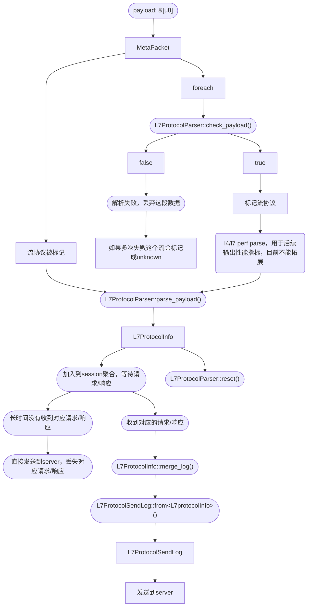

# DeepFlow 协议开发文档

这里是 DeepFlow 的协议开发文档，帮助开发者在 DeepFlow 中快速添加应用层协议。

## 1. 了解包处理过程

在 deepflow-agent 中，数据包从原始字节到应用层结构，会经过以下阶段，其中主要用涉及到的结构和接口有：
- L7Protocol：源码位于 [l7_protocol.rs](../agent/crates/public/src/l7_protocol.rs)，用于标识协议常量。
- L7ProtocolParser：源码位于 [l7_protocol_log.rs](../agent/src/common/l7_protocol_log.rs)，这个 trait 主要用于协议判断和解析出 L7ProtocolInfo。
- L7ProtocolInfo：源码位于 [l7_protocol_info.rs](../agent/src/common/l7_protocol_info.rs)，这个结构由 L7ProtocolParser 解析出来，并且用于后续会话聚合。
- L7ProtocolInfoInterface：源码位于 [l7_protocol_info.rs](../agent/src/common/l7_protocol_info.rs)，L7ProtocolInfo 都需要实现这个接口。
- L7ProtocolSendLog：源码位于 [pb_adapter.rs](../agent/src/flow_generator/protocol_logs/pb_adapter.rs)，统一发送到 deepflow-server 的结构。

整体流程大概是：


## 2. 如何开发

在 deepflow-agent 中开发的大致步骤：
1. 在 [l7_protocol.rs](../agent/crates/public/src/l7_protocol.rs) 添加对应协议名称和协议号。
2. L7ProtocolParser::parse_payload() 需要返回 L7ProtocolInfo，所以需要先定义一个结构，实现 L7ProtocolInfoInterface 接口并且添加到 [l7_protocol_info.rs](../agent/src/common/l7_protocol_info.rs) L7ProtocolInfo 这个枚举。
3. 实现 L7ProtocolParserInterface 接口，并添加到 [l7_protocol_log.rs](../agent/src/common/l7_protocol_log.rs) 中的 `all_protocol!` 宏。

在 deepflow-server 中只需增加一个常量用于搜索提示即可。

## 3. 看一个例子

以 [postgresql.rs](../agent/src/flow_generator/protocol_logs/sql/postgresql.rs) 为例：

### 3.1. 添加协议名常量和结构体

在 [l7_protocol.rs](../agent/crates/public/src/l7_protocol.rs) 添加对应协议名称和协议号：
```rust
// 协议号不能重复并且必须小于等于 127
pub enum L7Protocol {
    // ... other protocol
    Postgresql = 61,
    // ... other protocol
}
```

定义协议结构体：
```rust
// 派生宏至少要有 Debug, Clone, Serialize 这三个
#[derive(Debug, Clone, Serialize)]
pub struct PostgreInfo {
    // struct field define here
}
```

### 3.2. 实现 L7ProtocolInfoInterface

```rust
impl L7ProtocolInfoInterface for PostgreInfo {
    fn session_id(&self) -> Option<u32> {
        // 这里返回流标识id，例如 http2 返回 streamid，dns 返回 transaction id，如果没有就返回 None
    }

    fn merge_log(&mut self, other: L7ProtocolInfo) -> Result<()> {
        if let L7ProtocolInfo::PostgreInfo(pg) = other {
            // 请求/响应合并逻辑，目前返回错误没有任何作用
        }
        return Ok(());
    }

    fn app_proto_head(&self) -> Option<AppProtoHead> {
        // 这里返回一个 AppProtoHead 结构，返回 None 直接丢弃这段数据
        return Some(AppProtoHead {
            // 标识 L7 协议类型，直接填上对应的协议类型
            proto: L7Protocol::Postgresql,
            // msg_type 表示请求类型还是响应类型，用于 Session 聚合判断请求/响应
            msg_type: LogMessageType::Response, // or LogMessageType::Request
            // round trip time，不需要记录可以返回 0
            rrt: 0,
        });
    }

    // 一般返回 false
    fn is_tls(&self) -> bool {
        false
    }

    // 在发送到 deepflow-server 之前会调用，用于判断是否跳过发送，可以用于过滤空数据
    fn skip_send(&self) -> bool {
        false
    }
}


impl impl From<PostgreInfo> for L7ProtocolSendLog {
    fn from(p: PostgreInfo) -> L7ProtocolSendLog {
        // 这里需要把 info 转换成统一的发送结构 L7ProtocolSendLog
    }
}
```

L7ProtocolSendLog 结构，主要用于将不同的应用层协议转换成统一的结构发送到 deepflow-server：
```rust
pub struct L7ProtocolSendLog {
    // 请求长度，不需要可以填 None
    pub req_len: Option<u32>,
    // 响应长度，不需要可以填 None
    pub resp_len: Option<u32>,

    /*
    pub struct L7Request {
        // 请求类型，例如 HTTP 的请求方法，PostgreSQL 的请求命令
        pub req_type: String,
        // 请求域，例如 HTTP 的 host
        pub domain: String,
        // 请求资源，例如 HTTP 的 path，Redis 的指令，SQL 里的查询语句
        pub resource: String,
    }
    */
    pub req: L7Request,

    /*
    pub struct L7Response {
        /*
        响应状态枚举
        pub enum L7ResponseStatus {
            Ok, // 没有错误
            Error, // 发生了错误
            NotExist, //
            ServerError, // 服务端错误
            ClientError, // 客户端错误
        }
        */
        pub status: L7ResponseStatus,
        // 错误码
        pub code: Option<i32>,
        // 异常信息
        pub exception: String,
        // 响应结果
        pub result: String,
    }
    */
    pub resp: L7Response,

    // 协议版本
    pub version: Option<String>,
    // 这个一般填 None
    pub trace_info: Option<TraceInfo>,
    // 额外的拓展信息
    pub ext_info: Option<ExtendedInfo>,
}
```

添加到 `all_protocol_info!` 宏：
```rust
all_protocol_info!(
    // ... other info
    PostgreInfo(PostgreInfo),
    // ... other info
);
```

### 3.3. 实现 L7ProtocolParserInterface

```rust
// 定义结构
pub struct PostgresqlLog {
    // check_payload 和 parse_payload 都用的同一个结构，如果 check_payload 已经能解析，
    // 那么 parse_payload 可以直接返回结果，避免重复解析。
    // parsed: bool,
    // ...
}

impl L7ProtocolParserInterface for PostgresqlLog {
    fn check_payload(&mut self, payload: &[u8], param: &ParseParam) -> bool {
        // 协议判断，关于 ParseParam：
        /*
        pub struct ParseParam {
            // 网络层和传输层协议信息
            pub l4_protocol: IpProtocol,
            pub ip_src: IpAddr,
            pub ip_dst: IpAddr,
            pub port_src: u16,
            pub port_dst: u16,

            // 包方向，表示客户端请求还是服务端响应
            pub direction: PacketDirection,

            // eBPF 类型，有以下4个值：
            //   TracePoint：
            //       主要来源于 eBPF tracepoint 的 syscalls:sys_enter_read
            //                                   syscalls:sys_exit_read
            //                                   syscalls:sys_enter_write
            //                                   syscalls:sys_exit_write
            //                                   syscalls:sys_enter_recvfrom
            //                                   syscalls:sys_exit_recvfrom
            //                                   syscalls:sys_enter_sendto
            //                                   syscalls:sys_exit_sendto                           
            //   TlsUprobe:
            //       来源于 uprobe tls 相关库的 hook 点， 例如 golang 的 tls库，OpenSSL 的共享 so 库等等
            //   GoHttp2Uprobe：
            //       来源于 uprobe golang 相关的 HTTP 库，如果自定义协议的解析顺序放在 HTTP 后则不可能遇到
            //   None：非 eBPF 数据，即来源于 AF_PACKET
            //
            // 目前 ebpf 不支持拓展，所以现在只可能是 None
            pub ebpf_type: EbpfType,

            // ebpf_type 不为 None 会有值，目前 ebpf 不支持拓展，所以现在永远是None
            pub ebpf_param: Option<EbpfParam>,

            // 时间，单位 micro second
            pub time: u64,
        }
        */
    }

    // 由字节数组解析出L7ProtocolInfo，虽然返回是数组，但是这里如果没有特别的情况建议只返回一个 L7ProtocolInfo
    fn parse_payload(&mut self, payload: &[u8], param: &ParseParam) -> Result<Vec<L7ProtocolInfo>> {
        if self.parsed {
            // ...
        }

    }

    // 返回对应协议
    fn protocol(&self) -> L7Protocol {
        L7Protocol::Postgresql
    }

    // 重置解析器，会在每次 parse_payload 后调用，然后用作下次解析。
    fn reset(&mut self) {
        *self = Self::default();
    }

    // 当网络层协议是 udp 时是否解析，用于快速过滤
    fn parsable_on_udp(&self) -> bool {
        return false;
    }

    // 当网络层协议是 tcp 时是否解析，用于快速过滤
    fn parsable_on_tcp(&self) -> bool {
        return true;
    }
}
```

### 3.4. 添加解析器

在 [l7_protocol_log.rs](../agent/src/common/l7_protocol_log.rs) 的 `all_protocol!` 宏添加新增解析器：
```rust
// 这里分为4部分：
// Postgresql,PostgresParser,PostgresqlLog::default;
//
// 第1部分 Postgresql，是第一步 L7Protocol 枚举定义的名称。
// 第2部分 PostgresParser，枚举名称，这个名称理论上不重复就可以。
// 第3部分 PostgresqlLog，实现解析器接口的结构名称。
// 第4部分 default，实现解析器接口的结构的创建函数，宏里面会拼接，例如这个例子会拼接成 PostgresqlLog::default()，不能有参数。
//
// 宏的顺序就是协议判断和解析的顺序，由于 HTTP 的普遍性和特殊性（存在 v1/v2 版本并且有 uprobe hook 点），HTTP 协议需要优先解析并且不作为宏参数。
all_protocol!(
    // other parser
    Postgresql,PostgresParser,PostgresqlLog::default;
    // other parser
);
```

## 4. deepflow-server 中添加协议常量和名称（可选）

在 deepflow-server 添加协议常量和名称，用于搜索。这一步是可选操作，如果省略这一步，所有新增协议的协议名称都会记录为unknown，流日志中只能通过协议号搜索。

### 4.1.

在 [flow.go](../server/libs/datatype/flow.go) 中，添加对应常量和字符串
```go
type L7Protocol uint8

const (
	// ... other protocol
	L7_PROTOCOL_POSTGRE    L7Protocol = 61
	// ... other protocol
)


// ... 

func (p L7Protocol) String() string {
	formatted := ""
	switch p {
	// ... other case
	case L7_PROTOCOL_POSTGRE:
		formatted = "postgresql"
	// ... other case
	}
	return formatted
}

```

### 4.2. 在 deepflow-server 中增加常量

为 Querier 增加协议常量定义：[l7_protocol](../server/querier/db_descriptions/clickhouse/tag/enum/l7_protocol)

## 5. 一些说明

- 数据的抓取主要有两个来源：
  - eBPF 的 hook 点，主要来源于 read/write 系统调用
  - AF_PACKET 抓取网卡数据
- eBPF 由于在内核端有简单的协议过滤，目前eBPF采集的数据不支持添加协议
- 由于网络环境和协议的复杂性，有可能会接收到不完整的应用层数据帧
  - 例如 MTU 限制导致 IP 分片，TCP 对端接收窗口或者流控拥堵窗口收缩，MSS 过小等原因导致获取不到完整的应用层数据帧
  - 目前尚未实现传输层连接跟踪
- 数据可能乱序或丢失，例如 HTTP 可能有先收到响应再收到请求，但乱序并不会影响 Session 聚合
