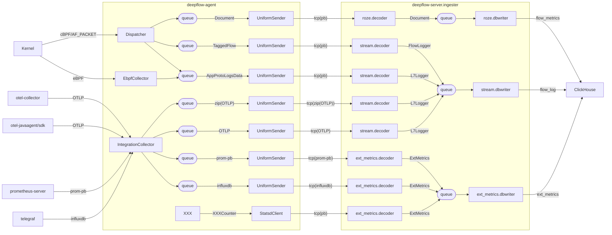
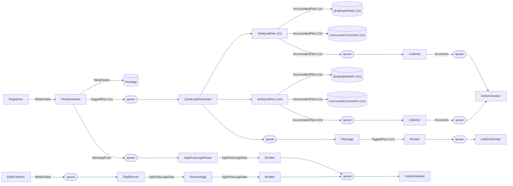
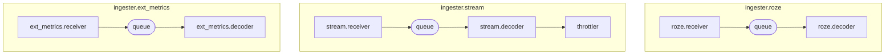

# 1. Data Collection

## 1.1. overview

## 1.2. From Dispatcher/EbpfCollector to UniformSender

## 1.3. In deepflow-server.ingester.xxx.decoder

# 2. Meta Collection

TODO

# 3. AutoTagging

TODO

# 4. Agent Management

TODO
