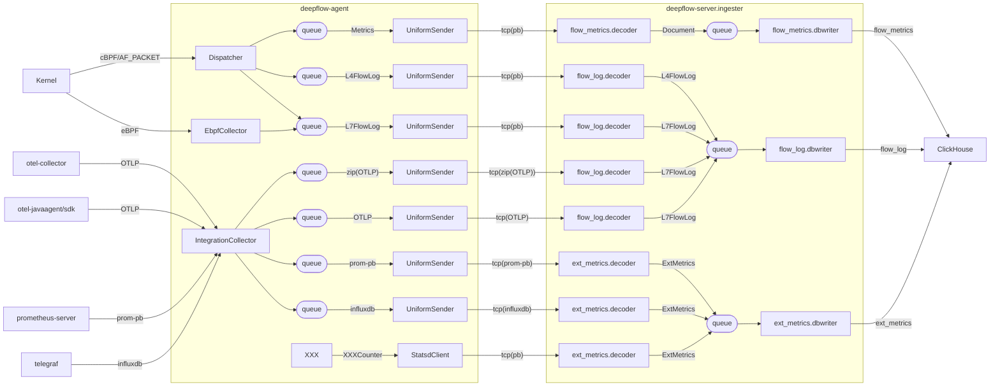
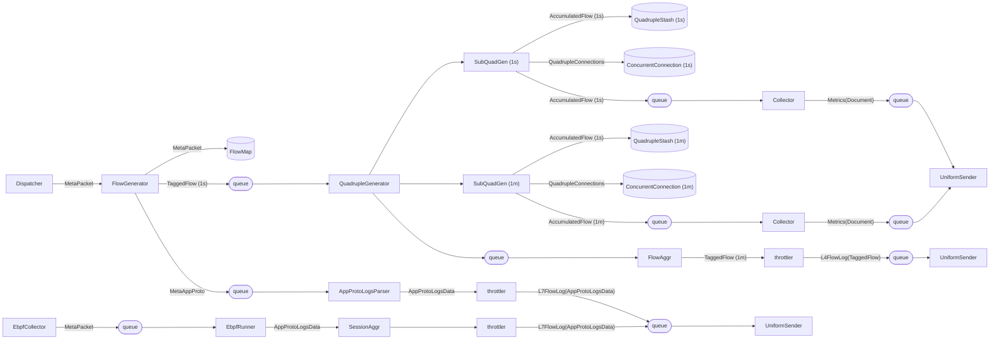
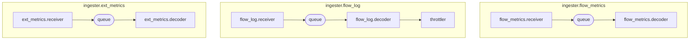
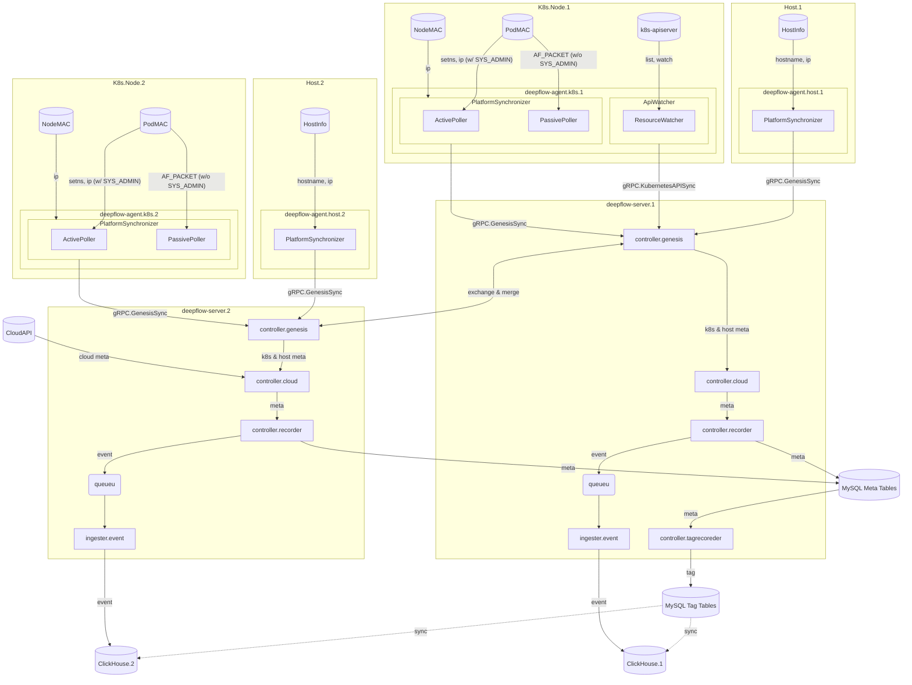
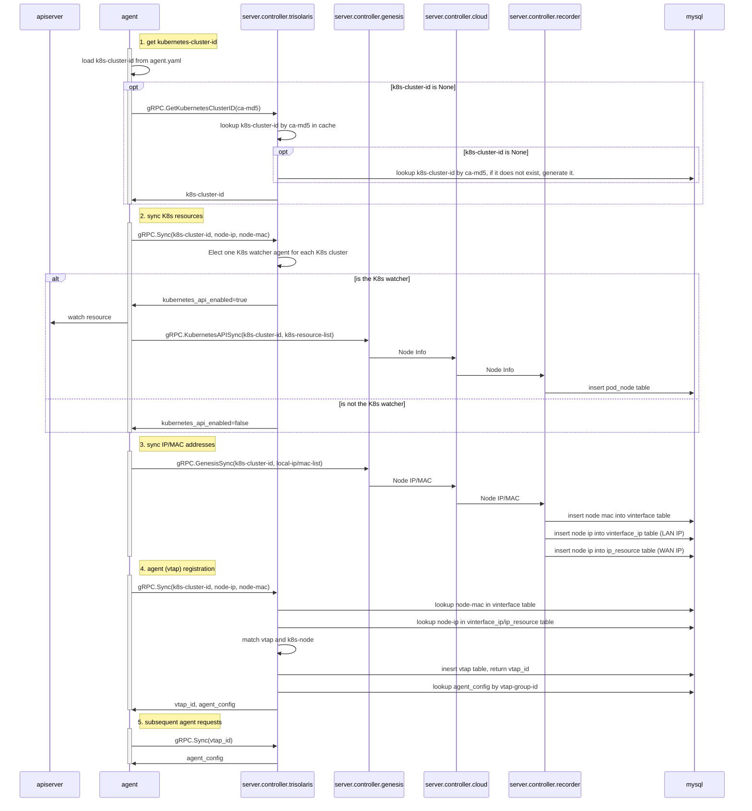
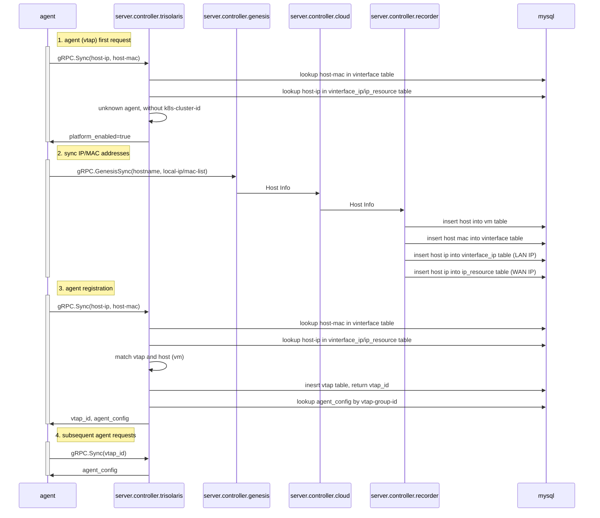

# 1. Data Collection

## 1.1. Overview

## 1.2. From Dispatcher/EbpfCollector to UniformSender

## 1.3. Decoders In deepflow-server.ingester

# 2. Meta Collection

# 3. Agent Registration

## 3.1. Agent on K8s Node

## 3.2. Agent on Legacy Host

## 3.3. Agent on Cloud Host

# 4. AutoTagging

TODO

# 5. Agent Management

TODO
