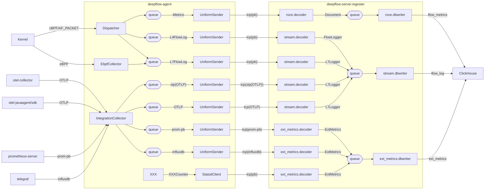

# 1. Data Collection

## 1.1. Overview

## 1.2. From Dispatcher/EbpfCollector to UniformSender

## 1.3. Decoders In deepflow-server.ingester

# 2. Meta Collection

TODO

# 3. AutoTagging

TODO

# 4. Agent Management

TODO
