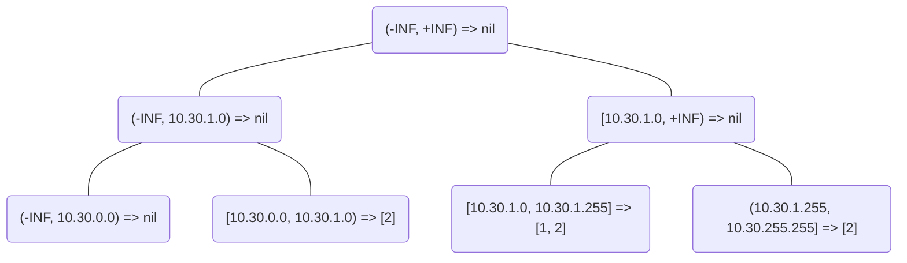

简介
====

此工程包含的是droplet所需的公有的、抽象的数据结构和函数

queue队列
---------

虽然Golang已经在`github.com/Workiva/go-datastructures的PriorityQueue`
提供了`Queue`和`PriorityQueue`，但是在这些方面它们不能够满足我们的需求：

1. 我们需要的是一个固定长度的queue，虽然这可以通过外部代码判断当前queue长度解决
2. 当超出queue尺寸时，我们希望直接覆盖掉queue中较旧的数据
3. 它们入队和出队的机制恐怕会导致较为频繁的内存申请，而我们更期望使用环形数组来减少内存申请
4. 我们希望Queue能够通过statsd上报当前的队列长度，以方便分析组件间的性能瓶颈

从性能数据上看，queue单次入队需要耗费73.7 ns/op，单次出队需要耗费24.8 ns/op，而如果8个协程同时出队，
开销则会上升到235 ns/op。因此在接收处应当尽可能通过Gets来单次获取尽可能多的数据，
此时如果性能瓶颈在于接收端，单个消息的时间开销将会接近1 ns/op，想来已经足够的高效了。

segmenttree线段树
-----------------

这里的线段树实现的是一个不可变的多维线段树，用于合并交叠数据并提供查询。一个典型示例如下：

假设存在如下的数据需要生成线段树
```
10.30.1.0/24 => 1
10.30.0.0/16 => 2
```

那么生成的树将会是


那么我想要查询10.30.1.128/23所对应的数据集时，便能够得到[1, 2]的结果

无锁对象池性能分析
------------------

目前pool的性能数据如下
```
goos: linux
goarch: amd64
pkg: github.com/deepflowio/deepflow/server/libs/pool
BenchmarkPoolGet-20             50000000                29.8 ns/op             4 B/op          0 allocs/op
BenchmarkPoolPut-20             30000000                62.1 ns/op             6 B/op          0 allocs/op
BenchmarkPoolHungryGet-20       50000000                28.6 ns/op             0 B/op          0 allocs/op
BenchmarkPoolOverPut-20         50000000                24.9 ns/op             0 B/op          0 allocs/op
PASS
ok      github.com/deepflowio/deepflow/server/libs/pool  12.126s
```
由于设计上pool就是无锁pool，因此不论是否遇到多线程互斥，pool的性能都会是这个数字，
如果profiler上看到pool的开销过大，那么说明的是对象构造函数开销过大而非pool本身的开销过大。

平台信息查询结果说明
--------------------

接入网络和虚拟网络查找过程现在是一致的

基础查找条件及对应结果：

  - MAC，IP不在数据库内
    - 查找结果L3EpcId=0，L2EpcId=0，IsL3End=false
    - 进行附1，2，3，4修正
  - MAC不在数据库，IP包含在数据库ip_resource表内
    - 查找的结果L3EpcId=-1，L2EpcId=0，IsL3End会根据查找包的Ttl(64,128,256)进行修正
    - 进行附3，4修正
  - MAC不在数据库, IP属于某个设备并且if_type=3
    - 查找的结果L3EpcId=(设备的EpcId)，L2EpcId=0，IsL3End(MAC和IP属于同一个设备则为true)
    - 进行附3，4修正
  - MAC不在数据库, IP属于某个设备并且if_type!=3
    - 查找结果L3EpcId=0，L2EpcId=0，IsL3End=false
    - 进行附1，2，3，4修正
  - MAC和IP属于同一个设备
    - 查找结果L3EpcId=(设备的EpcId)，L2EpcId=(设备的EpcId)，IsL3End=true
  - MAC属于某一设备，IP不在数据库里
    - 查找结果L3EpcId=0，L2EpcId=设备EpcId，IsL3End=false
    - 进行附2，3，4修正
  - MAC属于某一设备，IP属于另一设备, 两个设备属于同一个EpcId
    - 查找结果L3EpcId=(IP设备的EpcId)，L2EpcId=(MAC设备的EpcId)
    - 进行附3修正
  - MAC属于某一设备，IP属于另一设备, 两个设备属于不同的EpcId，IP的if_type!=3
    - 查找结果L3EpcId=0，L2EpcId=(MAC设备EpcId)
    - 进行附3修正
  - MAC属于某一设备，IP属于另一设备, 两个设备属于不同的EpcId，IP的if_type=3
    - 查找结果L3EpcId=(IP设备的EpcId)，L2EpcId=(MAC设备的EpcId)
    - 进行附3修正
  - MAC属于某一设备，IP属于ip_resource表内数据
    - 查找结果L3EpcId=-1，L2EpcId=(MAC设备的EpcId)，IsL3End=false
    - 进行附3，4修正
  - host_0/host_1对应的是MAC的Host
    - 可能出现host_0/host_1是属于同一个宿主机，但是IP分别属于不同的宿主机，这是正常的

附：

  - 1. 若L3EpcId=0，对端的L2EpcId!=0，则会在对端项目内查找对应资源，消除arp代理的影响
  - 2. l3EpcId=0，IP包含在{10.0.0.0/8, 172.16.0.0/12, 192.168.0.0/16, 255.255.255.255/32}内的数据，
      修正l3EpcId=-1
  - 3. 若源IsL3End=false，查询Key的Ttl在(64,128,255)内，则源IsL3End将设置为true，只使用于源
  - 4. 若IsL3End为false，则会根据Arp表进行修正，若存在MAC和IP的对应关系则将IsL3End设置为true，
  - 5. IsL2End值由trident传过来的数据直接赋值

  注意：若无特殊说明，修正方式同时适用于源和目的，查询结果以修正后的数据为准

SubnetId查询依据

  - 查MAC表获取L2EpcId，L2EpcId + Ip作为Key查询EpcIp表获取SubnetId
  - 若查询EpcIp表没有数据，则直接用Ip作为Key查询Ip表获取SubnetId
  - 若都没有数据则SubnetId=0

EndpointData查找流程
--------------------

1. 使用packet中的MAC，在MAC表中查找L2层数据
2. 使用L2层数据L2EpcId和packet中的IP组合为KEY, 查询EpcIp表获取L3层数据(若第一步没有查到数据，则L2EpcId=0)
3. 若第二步没有查到数据，则使用packet中的IP作为KEY，查询Ip表，获取L3层数据
4. 使用L3层的L3EpcId和packet中的IP组合为KEY，查找IP资源组信息
5. 通过源端和目的端数据对比进行修正(若源端L3EpcId为0而目的端l2EpcId不为0，则用目的端l2EpcId+源端IP为KEY，
   查询EpcIp表获取源端L3层数据，若目的端L3EpcId为0，则对比源端做类似操作)

注意： L2层数据通过MAC查找一次确定，L3层数据通过EpcIp表和Ip表来确定

L2层数据:
* L2EpcId
* L2DeviceType
* L2DeviceId
* L2End
* HostIp
* GroupId(DEV)

L3层数据:
* L3EpcId
* L3DeviceType
* L3DeviceId
* L3End
* SubnetId
* GroupId(IP)

EndpointData内存占用
------------------------

EndpointData结构如下：

    L3_L2_END_MAX = 4
    type EndpointData struct {
        SrcInfo *EndpointInfo
        DstInfo *EndpointInfo
        SrcInfos [L3_L2_END_MAX]EndpointInfo
        DstInfos [L3_L2_END_MAX]EndpointInfo
    }

* 每个EndpointInfo占用 40 + N * 4 byte(N为资源组个数)
* SrcInfo有n个资源组，DstInfo有m个资源组，则EndpointData占用 40 * 8 + n * 4 * 4 + m * 4 * 4 byte

FistPath内存占用：

* 每查一次FirstPath都会产生一条EndpointData数据，所以和查询次数相关，对于稳定的网络环境
假设每个EndpointInfo有4个资源组，总共需要查询1000次则产生内存1000 * (320 + 64 + 64) = 437.5MByte

FastPath内存占用：

* FastPath有1000个EndpointData数据，每个EndpointInfo有4个资源组，则占用内存为 1000 * (320 + 64 + 64) = 437.5MByte

ACLGID和Group对应关系
------------------------

1. 在PolicyData中添加一个AclGidBitmaps的slice，每一个AclGidBitmap表示对应到EndpoinData内Group的关系，具体含义如下：
   - b63-62（2bits）：表示映射端mapSide，b00表示映射源资源组，b01表示映射目的资源组
   - b61-56（6bits）：表示偏移值offset，从源/目的资源组slice的第offset*56个资源组开始对应
   - b55-0（56bits）：表示映射关系mapBits，如果对应bitN为1，表示对应的第offset*56+N个资源组包含在当前AaclGid中

2. 在AclAction中用18个bit来把ACLGID对应到bitmap，其中14个bit表示在ACLGIDBitmaps slice中的offset，4个bit表示占用的bitmap个数

policy firstpath查找流程
------------------------

查找使用的全局map及其初始化流程：

             名字       |                                     流程
    --------------------|---------------------------------------------------------------------------------
	InterestProtoMaps   | 使用策略中的Proto做key，设置value为true
	InterestPortMaps    | 使用策略中的PortRange, 生成一系列无交集的PortRange，key为无交集的PortRange中的端口，value为对应的PortRange
	InterestGroupMaps   | 使用策略中的GroupId做key，设置value为true
	GroupPortPolicyMaps | 策略使用PortRange查InterestPortMaps，将查找的PortRange.Min()赋值给策略对应的Port字段，策略中的SrcGroupIds + DstGroupIds + SrcPort + DstPort做key, policy为value, policy无方向
	GroupVlanPolicyMaps | 策略中的SrcGroupIds + DstGroupIds + Vlan 做key, policy为value, policy的方向为正, 策略中的DstGroupIds + SrcGroupIds + Vlan 做key, policy为value, policy的方向为反

查找流程：

  - 使用packet中的Proto、Group字段，在Interest相关map中查找，若为false则将packet中对应字段置为0
  - 使用packet中的Port字段，在InterestPortMaps中查找，将Port改为PortRange.Min()
  - 查找Port相关的策略
    - 使用packet中的SrcGroupIds + DstGroupIds + SrcPort + DstPort生成一系列正方向的keys， 使用keys在GroupPortPolicyMaps[Proto]中查找，将查找到的policy合并方向为正
    - 使用packet中的DstGroupIds + SrcGroupIds + DstPort + SrcPort生成一系列反方向的keys， 使用keys在GroupPortPolicyMaps[Proto]中查找，将查找到的policy合并方向为反
  - 查找Vlan相关的策略
    - 使用packet中的SrcGroupIds + DstGroupIds + Vlan生成一系列的keys， 使用keys在GroupVlanPolicyMaps中查找，将查找到的policy合并

policy fastpath查找流程
-----------------------

查找使用的全局map及说明：

             名字         |                                          说明
    ----------------------|----------------------------------------------------------------------------------------------------
     IpNetmaskMap         | 根据平台数据和IP资源组生成的map, key为uint16(IP>>16), value为最大掩码，例如0xffff0000
     FastPolicyMap        | 当Mask > 16时, key为uint64(maskedSrcIp << 32 + maskedDstIp), value为VlanAndPortMap
     FastPolicyMapMini    | 当Mask <= 16时, key为uint32((maskedSrcIp & 0xffff0000) + maskedDstIp >> 16), value为VlanAndPortMap
     VlanAndPortMap       | 结构体中有macEpcMap、vlanPolicyMap和portPolicyMap
     macEpcMap            | key为mac地址，value为epcId
     vlanPolicyMap        | key为 srcEpcId + dstEpcId + vlan, value为policy
     portPolicyMap        | key为 srcEpcId + dstEpcId + srcPort + dstPort, value为PortPolicyValue结构体
     PortPolicyValue      | 结构体中有endpoint、protoPolicyMap和timestamp
     protoPolicyMap       | key为Proto, value为policy

创建和查找流程：

  - 当流量进入firstpath后，无论是否有策略都会向fastpath下发策略
  - 使用packet中的IP在IpNetmaskMap查找Mask(IPv6使用0.0.0.0计算), 经过计算后得到maskedSrcIp和maskedDstIp, 若Mask都小于等于0xffff0000
    后续使用FastPolicyMapMini，否则使用FastPolicyMap，后续步骤统一使用`FastMap`
  - 用maskedSrcIp和maskedDstIp做key，在FastMap中查找获取VlanAndPortMap，若无则创建
  - 创建时使用mac和对应的epcId向VlanAndPortMap结构体中的macEpcMap插入数据, 查找使用mac查对应的epcId
  - 插入或查找Port相关Policy
    - 使用srcEpcId、dstEpcId、srcPort和dstPort做key，在portPolicyMap查找PortPolicyValue结构体，若无则创建
    - 使用proto做key, 在PortPolicyValue结构体中的protoPolicyMap查找Policy, 若无则创建
  - 插入或查找Vlan相关Policy
    - 使用srcEpcId、dstEpcId和vlan做key，在vlanPolicyMap查找Policy，若无则创建

policy fastpath内存占用
-----------------------

fastPath存储的结构为FastPathMapValue：

    type FastPathMapValue struct {
    	endpoint  EndpointData
    	policy    *PolicyData
    	timestamp time.Duration
    }

假设每条acl带一个action, 每条EndPointInfo带有一个groupId则：

    FastPathMapValue = 78 + 20 + 8 = 106byte

若为NPB且fast存储都是1个NPB策略则:

    FastPathMapValue = 78 + 12 + 8 = 98byte

fastPath数据结构如下：

    FastPolicyMaps[queueCount][TAP_MAX][mapSize] -> VlanAndPortMap

    type VlanAndPortMap struct {
    	macEpcMap     map[uint64]uint32           // 大小为n * 12
    	vlanPolicyMap map[uint64]*PolicyData      // 大小为n * 20或n * 12
    	portPolicyMap map[uint64]*PortPolicyValue // 大小为n * 106
    }

假设queueCount为4，mapSize为1024*1024，则NPM使用内存为：

最小：

    VlanAndPortMap = (12 + 20) * 2 = 64byte
    FastPolicyMaps = 1 * 1 * 1 * 64 = 64byte

最大：

    VlanAndPortMap = n *(12 + 20 + 106) = 138 * n
    FastPolicyMaps = 4 * 3 * 1024 * 1024 * 138 * n = 1736441856 * n byte = n * 1656MByte

假设queueCount为4，mapSize为1000，则NPB使用内存为：

最小：

    VlanAndPortMap = (12 + 106) * 2 = 236byte
    FastPolicyMaps = 1 * 1 * 1 * 236 = 236byte

最大：

    VlanAndPortMap = n * (12 + 106) = n * 118byte
    FastPolicyMaps = 4 * 3 * 1024 * 1024 * 118 * n = 1484783616 * n byte = n * 1416MByte

若每个VlanAndPortMap记录一条：

即使用内存最小1k字节，最大NPM使用1656M字节、NPB使用1416M字节

APP与policy action的关系
------------------------

1. app与policy action的关系

    app | name | id | policy action
    ----|------|----|-------
    APPLICATION_ISP_ANALYSIS | 接入网络 | 1 | PACKET_COUNTING、FLOW_COUNTING、FLOW_MISC_COUNTING、GEO_POSITIONING
    APPLICATION_VL2_ANALYSIS | 虚拟网络 | 2 | PACKET_COUNTING、FLOW_COUNTING、FLOW_MISC_COUNTING
    APPLICATION_REPORT       | 报表     | 3 | PACKET_COUNTING、FLOW_COUNTING
    APPLICATION_ALARM        | 告警     | 4 | 流量峰值/流量总量：PACKET_COUNT_BROKERING
                             |          |   | 白名单：FLOW_COUNT_BROKERING
    APPLICATION_PERF         | 业务网络 ---- 性能量化   | 5 | FLOW_COUNTING、TCP_FLOW_PERF_COUNTING、FLOW_MISC_COUNTING、GEO_POSITIONING
    APPLICATION_WHITELIST    | 业务网络 ---- 安全白名单 | 6 | FLOW_COUNTING
    APPLICATION_FLOW_BACKTRACKING | 回溯分析            | 9 | FLOW_STORING

2. policy action包含关系

    action	| droplet需要做的处理 | 其它组件需要做的处理
    ------------|-------------------|--------------------
    PACKET_COUNTING	                | droplet (meteringApp)               | zero写入InfluxDB (df_usage)
    FLOW_COUNTING	                | droplet (flowGen, flowApp)          | zero写入InfluxDB (df_flow, df_fps)
    FLOW_STORING	                | droplet (flowGen, 性能量化, flowApp) | stream写入ES (dfi_flow)
    TCP_FLOW_PERF_COUNTING	        | droplet (flowGen, 性能量化, flowApp) | zero写入InfluxDB (df_perf)
    PACKET_CAPTURING                | N/A                                 | N/A
    FLOW_MISC_COUNTING		        | droplet (flowGen, flowApp)          | zero写入InfluxDB (df_type, df_console_log)
    PACKET_COUNT_BROKERING          | droplet (meteringApp)               | zero发送ZMQ (df_usage), alarmstrap
    FLOW_COUNT_BROKERING            | droplet (flowGen, flowApp)          | zero发送ZMQ (df_flow), alarmstrap
    TCP_FLOW_PERF_COUNT_BROKERING   | droplet (flowGen, 性能量化, flowApp) | zero发送ZMQ (df_perf), alarmstrap
    GEO_POSITIONING                 | droplet (flowGen, 性能量化, flowApp) | zero写入InfluxDB (df_geo)

flowgen+flowperf内存占用估计
----------------------------

每生成一条流，需要申请的一个新的FlowExtra结构体，其中包含MetaFlowPerf+TaggedFlow两个指针。
对于flowgen，输出TaggedFlow时还需申请TcpPerfStats；对于flowperf，每条流的MetaFlowPerf
结构体中还包含两个TcpSessionPeer链表，限制链表最大长度16。

可通过配置文件对最大流数量进行限制，其中flow-count-limit的默认值为1M。

1. 主要结构体及size(Byte)

    struct name    | size
    ---------------|-------
    MetaFlowPerf   |  328
    TcpSessionPeer |  48
    TcpPerfStats   |  96
    TaggedFlow     |  488
    FlowExtra      |  48

2. 理论内存占用

    理论上flowgen+flowperf内存占用应满足如下关系：

        最小：flow-count-limit * 1KB  (1056 = 48+488+328+96+48*1*2)

        最大：flow-count-limit * 2.5KB(2496 = 48+488+328+96+48*16*2)

    默认配置下，当流数量达到上限时，

        最小内存占用1G = 1M * 1KB

        最大内存占用2.5G = 1M * 2.5KB
